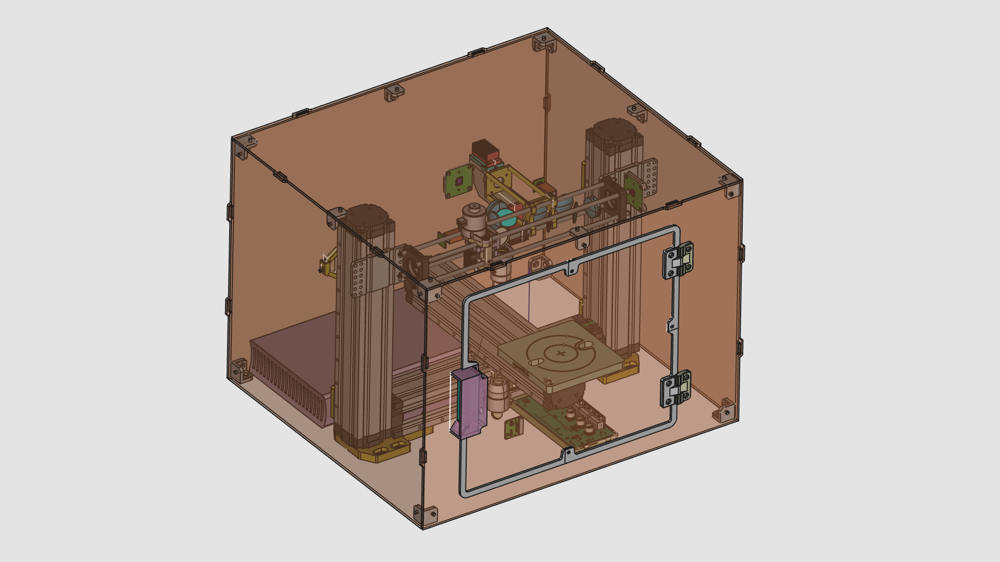
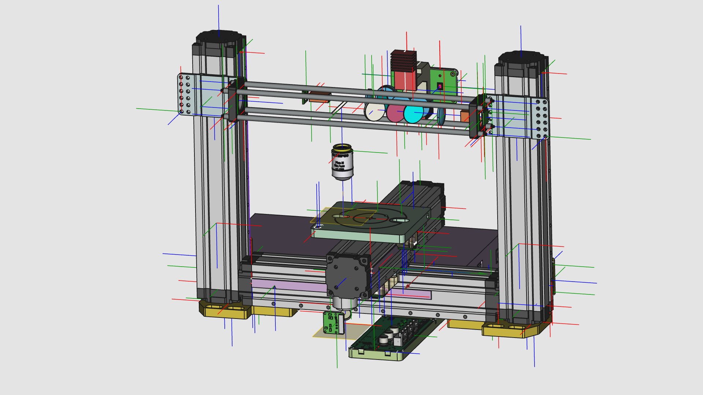

The **Medjed** maskless lithography aligner is part of the openMLA series of photolithography equipment. 

>  **🏗️ Construction in progress**
> A lot is still being worked on for this system. Hardware is being tested and performance will need to be evaluated before people will be able to build their own system. 

### Overview

The MEDJED system is a photolithography system - this means its primary function is to expose a (flat-ish) substrate to patterened light. The substrate will need to be coated in a layer of light-sensitive material known as photoresist. This resist layer in turn will undergo chemical reactions upon exposure to UV light, either rendering areas that were exposed soluble or insoluble to a (liquid) chemical developer. After development of the exposed photoresist layer, some areas of the substrate will remain coated in the photoresist, while others will be free of it. This is the starting point for further patterning steps and is the backbone of modern microfabrication.

The MEDJED system targets a 5um pixel size in its current design. The total project cost is targeted to be 2000-2500 euro. 

You will the majority of the documentation on [the project wiki](https://github.com/openMLA/Medjed/wiki).

### 🙋‍♂️Contributions

Currently the project development is in volatile waters; a lot is still changing and being tested. If you find the project very interesting and think you have some expertise in the relevant areas (e.g. optics, mechanics, machine safety, PCB design) feel free to reach out so we can see if we can divide up some tasks or if you can share some insight/critique into some of the current design layout!

If you are just interesting in trying out the system, or even just trying out some of the assemblies (e.g. just the Z-axis), your feedback and comments on the design files, practicalities and documentation are also very welcome.

### 📃 Current component selection

Below are some of the current components selected for the machine. They may change at any point and are not necessarily the best for the job.  Still, you may find some of them interesting components for your own project.

🔗 More detailed discussion of components choices will be put in the wiki 📑.

* XYZ axis: Snapmaker linear rails (not accurate enough for direct positioning)
* UV patterning: modified DMD projection unit from the Anycubic Photon Ultra DLP printer. See [this blog post for pictures and background](https://nemoandrea.github.io/blog/Anycubic_DLP_teardown/).
* Main optic: [Olympus Plan N 10X 0.25NA](https://www.edmundoptics.com/f/olympus-plan-achromatic-objectives/14535/).  Alternatively, [a cheaper version with the same optical design is produced in China](https://www.astroshop.eu/for-microscopes/evident-olympus-plcn10x-0-25-plan-achromat-objective/p,49913) by Olympus (part:N4239000) which should work just as well. 
* Encoders: [RLS RLC2IC magnetic encoder](https://www.rls.si/eng/rlc2ic-miniature-linear-and-rotary-pcb-level-incremental-magnetic-encoder) - 244nm spec, 2MHz
* Motion controller IC: [TMC4361A](https://www.trinamic.com/fileadmin/assets/Products/ICs_Documents/TMC4361_Datasheet_Rev3.10.pdf)
* Stage vacuum: Tetra APS pump (diaphragm type, reversed)
* Microcontroller: [Teensy 4.1](https://www.pjrc.com/store/teensy41.html)
* SBC:  [Odroid N2+](https://www.hardkernel.com/shop/odroid-n2-with-4gbyte-ram-2/)
* Cameras: [Daheng imaging MER2-630](https://www.get-cameras.com/USB3.0-Camera-6.3MP-Color-Sony-IMX178-MER2-630-60U3C) (one camera in mono, one in RGB)

### 🛠 Design Tools

Hardware parts are designed in [FreeCAD](https://www.freecad.org/)

PCBs are designed in [KiCAD](https://www.kicad.org/)

Art/Design is generated by Affinity Designer and [Inkscape](https://inkscape.org/).